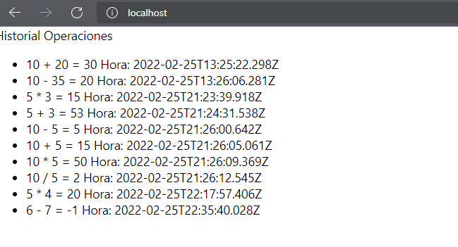
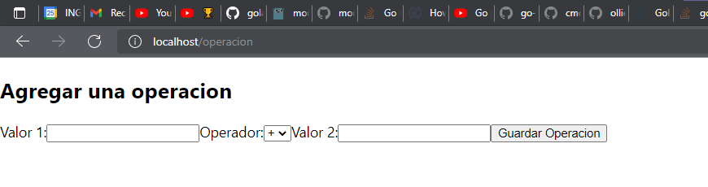
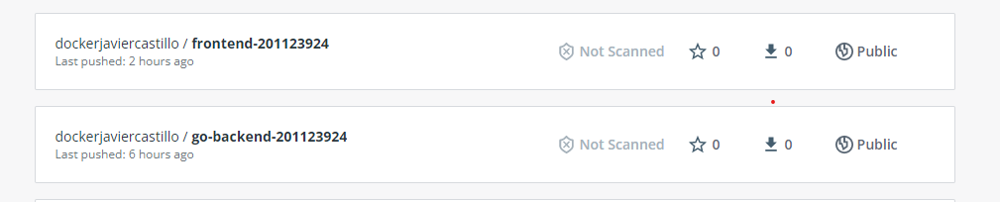

# practica_docker_compose
Creacion con docker compose de un frontend, backend y base de datos

## Manual usuario
Para visualizar todas las operaciones que ha realizado junto con el resultado y la hora
Solo debe ingresar a localhost en su navegar como se muestra a continuacion.

### Crear una nueva operación

Para crear una nueva operación debe ir en su navegador hacia 
localhost/operacion.

Debera ingresar el valor y el tipo de operacion (+,-,/,*) y presionar el boton 
Guardar Operación.

## Manual Tecnico

La arquitectura de la aplicación esta conforma por un frontend en React,
un backend en Go, y como base de datos utilizamos MongoDB.

Para el frontend y el backend se crearon imagen en docker y se subieron 
al dockerhub.

Luego se utilizo docker-compose para crear una instalación limpia de toda
la arquitectura en la cual cada componente depende del anterior para realizar su 
correcto funcionamiento.

